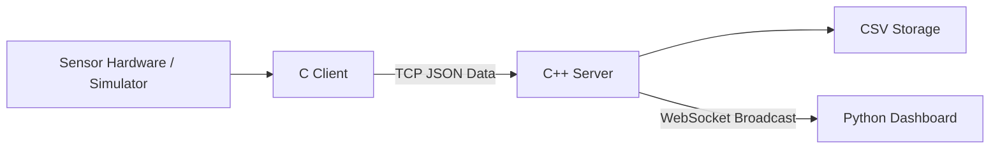
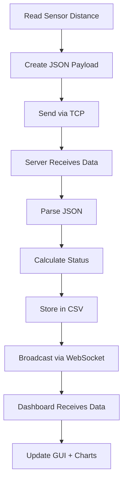

#  Proximity Sensor Monitoring System

<p align="center">
  
  
  
  
  
  
</p>

<p align="center">
  Mixed-language IoT-inspired proximity monitoring system with real-time sensor tracking, WebSocket streaming, and live visualization dashboard.
</p>

---

##  Overview

The **Proximity Sensor Monitoring System** is a real-time monitoring platform built with a **multi-language architecture**, where each language is selected for performance and suitability:

- **C Client** → Sensor communication & low-level hardware interface
- **C++ Server** → High-performance TCP/WebSocket server
- **Python Dashboard** → GUI visualization and analytics

This system simulates or integrates real proximity sensors and streams live readings to a dashboard.

---

##  Features

 Real-time proximity sensor monitoring  
 Multi-sensor support  
 TCP communication between client and server  
 WebSocket broadcasting for dashboard updates  
 Historical CSV logging  
 Status alerts with thresholds  

Status levels:
- 🟢 SAFE
- 🟡 CAUTION
- 🟠 WARNING
- 🔴 CRITICAL

 Docker support  
 Modular architecture  
 Linux compatible  

---

#  System Architecture

## High-Level Block Diagram



---

## Detailed Workflow



---

## Component Responsibilities

| Component | Language | Responsibility |
|---|---|---|
| Sensor Client | C11 | Sensor reading, JSON generation, TCP communication |
| Server | C++17 | Data parsing, status calculation, logging, broadcasting |
| Dashboard | Python 3.9 | GUI, analytics, charts, visualization |

---

#  Project Structure

```bash
proximity-system/
├── server.cpp
├── sensor_client.c
├── dashboard.py
├── Makefile
├── run-project.sh
├── docker-compose.yml
├── config.json
├── requirements.txt
├── README.md
├── logs/
│   ├── server.log
│   ├── client.log
│   └── dashboard.log
├── data/
│   └── sensor_data.csv
└── simple-websocket-server/
    └── server_ws.hpp
```

---

#  Requirements

## System Requirements

- Ubuntu / Debian Linux
- GCC 9+
- G++ 9+
- Python 3.9+
- Docker (optional)

---

## Required Packages

### Ubuntu/Debian

```bash
sudo apt update
sudo apt install \
    gcc \
    g++ \
    python3 \
    python3-pip \
    libjansson-dev \
    nlohmann-json3-dev \
    libssl-dev \
    wget
```

---

## Python Dependencies

Install from requirements:

```bash
pip3 install -r requirements.txt
```

### requirements.txt

```txt
websocket-client
pandas
matplotlib
tk
```

---

#  Quick Start

## 1. Clone Repository

```bash
git clone https://github.com/yourusername/proximity-system.git
cd proximity-system
```

---

## 2. One-Step Run

```bash
chmod +x run-project.sh
./run-project.sh
```

---

## 3. Manual Execution

### Compile Server

```bash
g++ -std=c++17 -o proximity_server server.cpp \
    -lpthread -lssl -lcrypto
```

### Compile Client

```bash
gcc -o sensor_client sensor_client.c \
    -lpthread -ljansson -lm
```

### Run Components

Terminal 1:

```bash
./proximity_server
```

Terminal 2:

```bash
./sensor_client
```

Terminal 3:

```bash
python3 dashboard.py
```

---

#  Docker Support

## Run with Docker Compose

```bash
docker-compose up --build
```

Run in background:

```bash
docker-compose up -d
```

Stop:

```bash
docker-compose down
```

---

# 📡 Communication Protocols

## Client → Server (TCP)

```json
{
  "sensor_id": "sensor_01",
  "distance": 45.5,
  "timestamp": "2026-05-14 14:30:25"
}
```

---

## Server → Dashboard (WebSocket)

```json
{
  "sensor_01": {
    "distance": 45.5,
    "status": "SAFE",
    "timestamp": "2026-05-14 14:30:25"
  }
}
```

---

#  Dashboard Features

## Real-Time Monitoring

- Live sensor grid
- Distance updates
- Color-coded alerts
- Timestamp tracking

---

## Historical Analysis

- Time-series charts
- Multi-sensor comparison
- CSV export

---

## Controls

- Connect / Disconnect
- Export logs
- Threshold configuration

---

# 🔧 Configuration

Edit `config.json`

```json
{
  "server": {
    "tcp_port": 5000,
    "websocket_port": 8080
  },
  "sensors": {
    "update_interval": 2,
    "distance_thresholds": {
      "critical": 10,
      "warning": 30,
      "caution": 50
    }
  }
}
```

---

#  Testing

## Simulate Multiple Sensors

```bash
./sensor_client --count 5 --interval 1
```

---

## Test TCP Connection

```bash
echo '{"sensor_id":"test","distance":25.5}' | nc localhost 5000
```

---

## Test WebSocket

```bash
wscat -c ws://localhost:8080/sensors
```

---

#  Performance

| Metric | Value |
|---|---|
| Latency | <100 ms |
| Throughput | 100+ sensors |
| Memory Usage | ~50 MB |
| CPU Usage | <5% idle |

---

# 🛠 Troubleshooting

## Port Conflict

```bash
sudo netstat -tulpn | grep -E '5000|8080'
```

---

## Firewall

```bash
sudo ufw allow 5000/tcp
sudo ufw allow 8080/tcp
```

---

## Debug Mode

```bash
./proximity_server --debug
```

---

#  Logs

```bash
logs/
├── server.log
├── client.log
├── dashboard.log
└── sensor_data.csv
```

---

#  Future Improvements

- REST API support
- Database integration (SQLite/PostgreSQL)
- Authentication
- Cloud deployment
- Mobile dashboard

---

#  Contributing

1. Fork repo  
2. Create branch  

```bash
git checkout -b feature/new-feature
```

3. Commit changes  

```bash
git commit -m "Add new feature"
```

4. Push branch  

```bash
git push origin feature/new-feature
```

5. Open Pull Request  

---


---

#  Acknowledgements

- Simple-WebSocket-Server
- Jansson
- nlohmann/json

---

<p align="center">
  Built with ❤️ using C, C++, and Python
</p>
````

